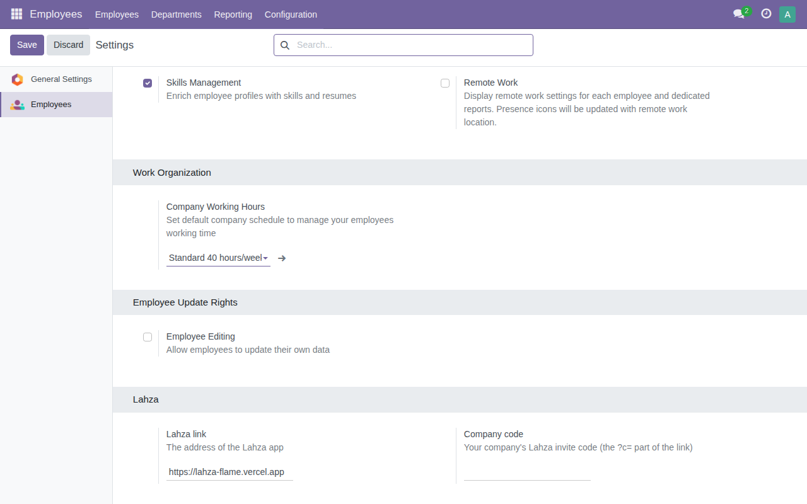
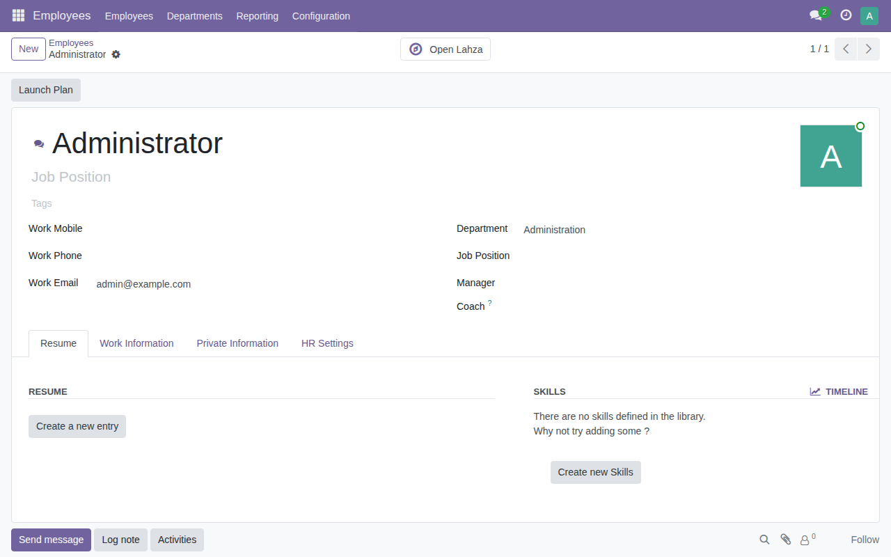
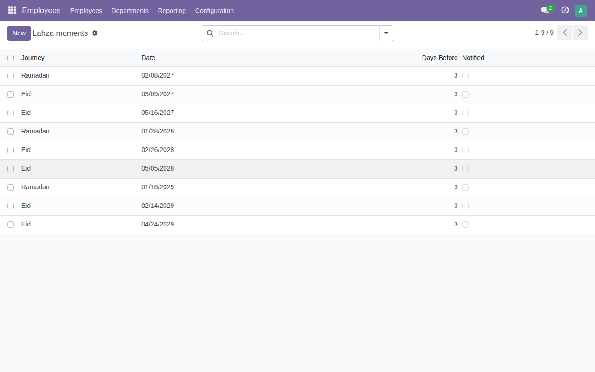

# Lahza for Odoo (Community 17, 18, 19, 20)

A small Odoo module that brings Lahza into employee onboarding:

- **Settings → Employees → Lahza**: the Lahza link and your company's invite code (the `?c=` part).
- **"Open Lahza"** button on every employee record. It opens Lahza in the employee's language (Arabic, Urdu, otherwise English) with the company code.
- **Employees → Configuration → Lahza moments**: dated moments (Ramadan, Eid). A daily scheduled action creates a to-do activity for every employee who has a user, a few days before each moment (3 by default), once per moment. The activity links straight to the journey, with the company code.

The moments come seeded for Hijri years 1448 to 1450 with first days by the Umm al-Qura calendar, the same calendar the app uses. The official announcement can differ by a day, so HR can edit any date.

The texts of the activity are fixed in the module (`models/lahza.py`). Nothing is generated by a model.

| Settings | Employee record | Moments |
|---|---|---|
|  |  |  |

Screenshots from Odoo 17 Community.

## Install

Pick the folder for your Odoo version and put `lahza_onboarding` in your addons path:

| Odoo | Folder |
|---|---|
| 17.0 | `17.0/lahza_onboarding` |
| 18.0 | `18.0/lahza_onboarding` |
| 19.0 | `19.0/lahza_onboarding` |
| 20.0 | `20.0/lahza_onboarding` |

```bash
cp -r integrations/odoo/18.0/lahza_onboarding /path/to/your/addons/
# restart Odoo, then Apps → Update Apps List → search "Lahza Onboarding" → Install
```

Depends on `hr` and `mail` only. Then open Settings → Employees, fill the Lahza link and company code, and save.

**Urdu:** Odoo does not ship an Urdu language. Employees whose Odoo language is Arabic get Arabic, everyone else gets English, unless the company adds a language with code `ur_PK`; then those employees get Urdu.

## For developers

`src/lahza_onboarding` is the only source, written for Odoo 18 and later. `./build.sh` makes the four version folders; Odoo 17 differs in two places only (`<tree>` instead of `<list>`, and `numbercall=-1` on the scheduled action). Edit `src/`, run `./build.sh`, commit both.

Odoo 20 also renamed two things the module uses: access rights moved to `ir.access.csv` (done by `build.sh`), and `get_param` became `get_str` (handled in code, so the source is the same).

Tests (`tests/test_lahza.py`): the button link, a reminder inside the window and only once, nothing before the window or after the date, employees without a user skipped, Arabic and Urdu texts. Run them against an Odoo checkout:

```bash
python odoo-bin --addons-path=addons,/path/to/lahza/integrations/odoo/18.0 -d test_lahza \
  -i lahza_onboarding --test-tags /lahza_onboarding --stop-after-init --without-demo=all
```

Last run, 4 October 2026, on Odoo Community 17.0, 18.0, 19.0 and 20.0 (the branch heads that day) with PostgreSQL 16: the module installs with no errors or warnings and all tests pass on each.
